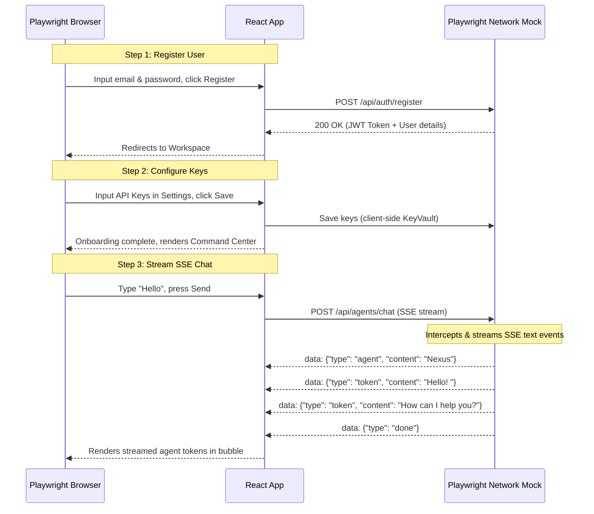

# Implementation Plan — Automated Frontend E2E Testing Suite

This plan details the setup and implementation of an automated End-to-End (E2E) testing framework for **Signhify AI** using Python and Playwright. 

Because the local Docker/MongoDB daemon is not active, we will use Playwright's **network interception API** to mock all API requests and stream Server-Sent Events (SSE). This enables us to test the entire client application (auth, settings, chat, and SSE streams) in a highly repeatable, zero-dependency environment.

---

## Proposed Changes

### [NEW] [test_e2e.py](file:///d:/Signhify_AI/test_e2e.py)
We will create a root-level Python script that automates browser verification via Playwright:
1. **Network Interception**: Mock `/api/auth/register`, `/api/auth/login`, `/api/threads`, and `/api/agents/chat`.
2. **Onboarding & Auth Test**: Fill registration inputs, verify transition to the workspace onboarding/dashboard.
3. **Settings Keys Test**: Open settings, enter API keys, save them, and verify State updates.
4. **SSE Chat Stream Test**: Create a thread, send a message, simulate streaming SSE chunks (status updates and text tokens), and verify the incoming response renders correctly in the chat viewport.

### [MODIFY] [walkthrough.md](file:///d:/Signhify_AI/walkthrough.md)
Update the walkthrough file with E2E test results, screenshot paths, and execution logs.

---

## E2E Testing Scenarios



---

## Verification Plan

### Automated Run
We will spin up the Vite development server in the background and run the Playwright testing script:
```bash
python "C:\Users\Piyush\.gemini\config\skills\webapp-testing\scripts\with_server.py" --server "pnpm --filter @signhify/web dev" --port 5173 -- python test_e2e.py
```

### Manual Deliverables
* Check logs printed in console.
* Capture and save a screenshot of the final chat session page at `artifacts/e2e_verified_chat.png`.
